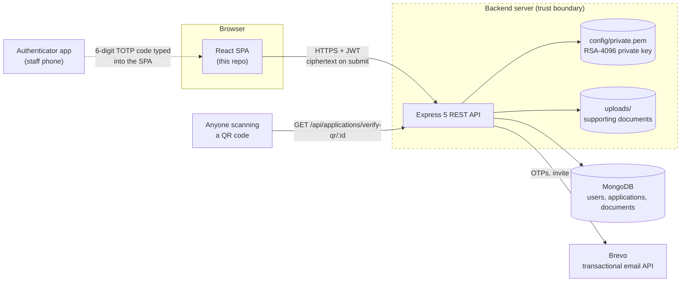
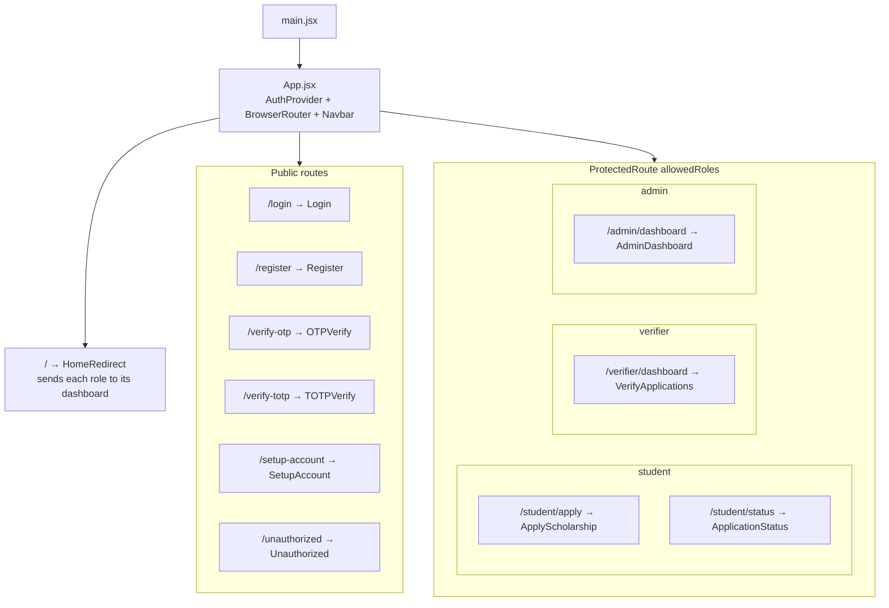
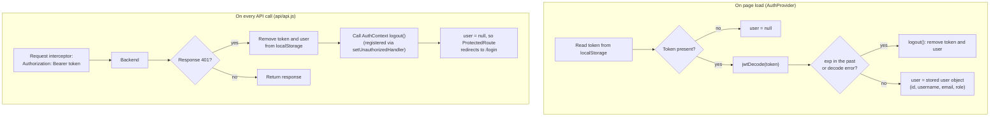
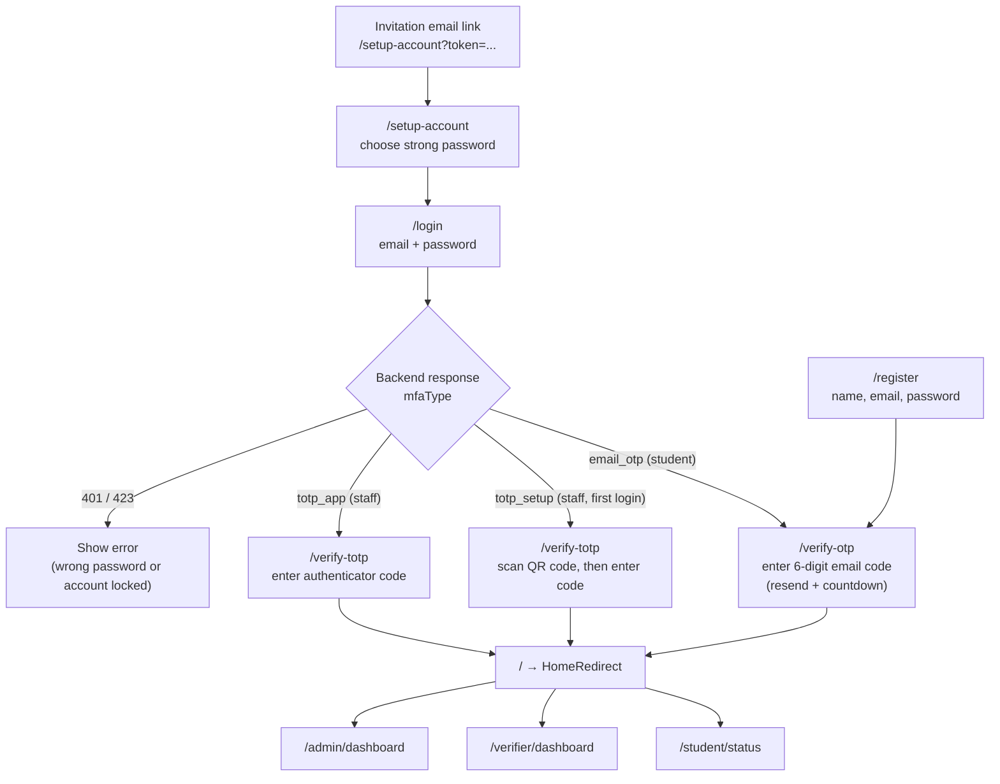
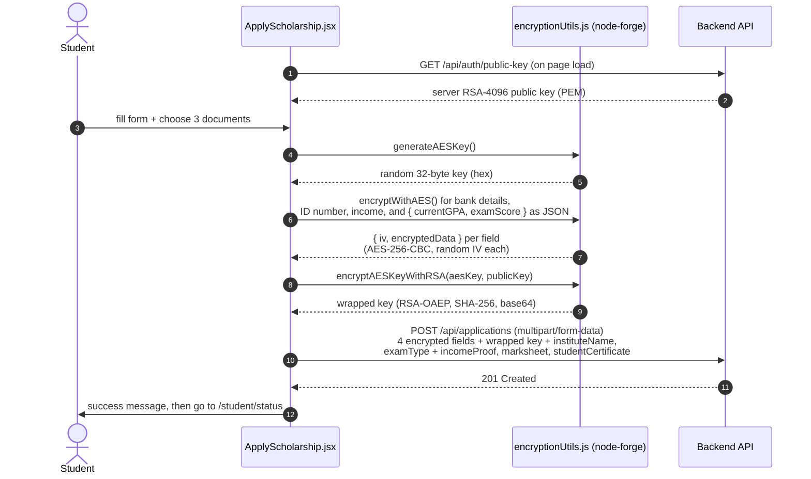
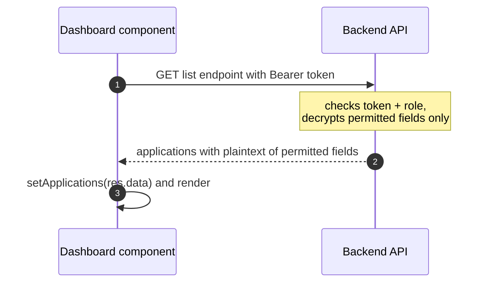

# SafeApply Frontend Architecture

This document explains how the SafeApply React client is put together, for anyone setting it up, using it, or contributing to it. It covers the app structure, session handling, the authentication screens, and how the browser encrypts application data before sending it.

SafeApply is a scholarship application system with three roles: **Student** (applies and tracks status), **Verifier** (reviews and verifies applications) and **Admin** (approves or rejects applications and manages staff).

The server side (API, authentication rules, decryption, signatures, data model) has its own document: [Backend Architecture](https://github.com/USER1043/ScholarshipSystem-Backend/blob/main/docs/ARCHITECTURE.md).

## Contents

1. [System context](#1-system-context)
2. [App structure](#2-app-structure)
3. [Session handling](#3-session-handling)
4. [Screen flows: login, registration and staff setup](#4-screen-flows-login-registration-and-staff-setup)
5. [Submitting an application: browser-side encryption](#5-submitting-an-application-browser-side-encryption)
6. [Dashboards: reading data](#6-dashboards-reading-data)
7. [Known limitations](#7-known-limitations)
8. [Contributing](#8-contributing)

---

## 1. System context

Everything inside the dashed box runs on the backend server. The browser only ever sends sensitive fields to the server as ciphertext.

## 2. App structure

`main.jsx` renders `App.jsx`, which wraps every route in `AuthProvider` so any component can read the logged-in user.

`ProtectedRoute` sends users who aren't logged in to `/login`, and users with the wrong role to `/unauthorized`. `HomeRedirect` sends students to `/student/status`, verifiers to `/verifier/dashboard` and admins to `/admin/dashboard`.

### Where code lives

| Folder / file | Responsibility |
| --- | --- |
| `src/api/api.js` | Axios instance: base URL from `VITE_BASE_URL`, attaches the JWT, clears the session on 401 |
| `src/context/AuthContext.jsx` | Login, OTP/TOTP verification, registration, logout; stores the session |
| `src/utils/encryptionUtils.js` | AES key generation, AES encryption, RSA wrapping of the AES key (node-forge) |
| `src/utils/roleHelper.js` | Role constants used by routes and redirects |
| `src/components/Auth/` | Login, Register, OTPVerify, TOTPVerify, SetupAccount |
| `src/components/Student/` | ApplyScholarship (encrypts and submits), ApplicationStatus |
| `src/components/Verifier/` | VerifyApplications |
| `src/components/Admin/` | AdminDashboard (approvals, rejections, staff onboarding, user management) |
| `src/components/Common/` | Navbar, ProtectedRoute, HomeRedirect, Unauthorized |

## 3. Session handling

- After a successful OTP or TOTP check, `AuthContext` stores `token`, `user` and (if "trust this device" was ticked) `deviceId` in `localStorage`.
- `jwtDecode` only reads the token's expiry. It does **not** verify the signature, and it doesn't need to: the backend verifies every token on every protected request.
- Route guards only decide which screens to show. **Access control is enforced by the backend**, which checks the token and role on every request.

## 4. Screen flows: login, registration and staff setup

- Students always use an email OTP, and the first successful OTP also activates a newly registered account.
- Staff always use an authenticator app. On the first login the backend returns a QR code, which `TOTPVerify` displays for scanning.
- Staff accounts can't be self-registered; an admin creates them from `AdminDashboard`, which sends the invitation email.

## 5. Submitting an application: browser-side encryption

`ApplyScholarship.jsx` encrypts the sensitive fields with helpers from `utils/encryptionUtils.js` before anything is sent. The plaintext values and the AES key never leave the browser unencrypted.

| Sent encrypted | Sent in plaintext |
| --- | --- |
| Bank details, Aadhaar ID number, income details, GPA and exam score | Institute name, exam type (JEE / NEET / GATE), uploaded documents; the applicant's name comes from their account |

The documents are protected in transit by HTTPS and by server-side access checks, but they are **not** encrypted by the browser.

## 6. Dashboards: reading data

The browser never decrypts application data, and there is no decryption helper in the codebase. The backend decrypts on the server and returns only the fields each role is allowed to see (see [Backend Architecture, section 7](https://github.com/USER1043/ScholarshipSystem-Backend/blob/main/docs/ARCHITECTURE.md#7-reviewing-server-side-least-privilege-decryption)).

| Component | Endpoint | Sensitive fields it receives |
| --- | --- | --- |
| `ApplicationStatus` (student) | `GET /api/applications/my` | bank details, ID number, income, GPA, exam score (own applications only) |
| `VerifyApplications` | `GET /api/verifier/applications` | ID number, income, GPA, exam score |
| `AdminDashboard` | `GET /api/admin/applications` | income, GPA, exam score |

`ApplicationStatus` also shows the QR code for approved applications and a button that calls `GET /api/applications/verify-signature/:id` to check that the approved record hasn't been tampered with.

## 7. Known limitations

- **The JWT is stored in `localStorage`.** Any script running on the page can read it, so a cross-site scripting (XSS) bug would expose the session. React escapes rendered values by default, which reduces this risk.
- **The server public key is fetched without authentication.** The site must be served over HTTPS; otherwise an attacker on the network could replace the key and read the data it wraps.
- **The "trust this device" option has no effect yet.** A `deviceId` is stored, but the backend doesn't use it to skip MFA.

## 8. Contributing

### Adding a page for an existing role

1. Create the component under `src/components/<Role>/`.
2. Add a `<Route>` inside that role's `ProtectedRoute` group in `App.jsx`.
3. Make API calls through `src/api/api.js` (never plain `fetch`/`axios`) so the token is attached automatically.
4. Make sure the backend route it calls uses `protect` and `authorize(...)`. The frontend guard alone does not secure anything.

### Adding a new sensitive field

Encrypt it in `ApplyScholarship.jsx` with the same per-application AES key (`encryptWithAES`) and send it as a JSON string. The backend changes (model, decryption field lists, signature record) are listed in [Backend Architecture, section 13](https://github.com/USER1043/ScholarshipSystem-Backend/blob/main/docs/ARCHITECTURE.md#13-contributing).
